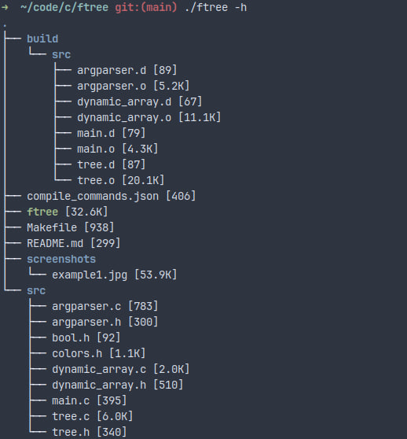

# ftree

Utility for printing filesystem as a tree.

## Usage

```
USAGE:
    ftree [options] [directory ...]

OPTIONS:
    -a
        Print all files.
    -d
        Directories only.
    -h
        Print size of each file in human readable format.
    -nc
        Turn off colored input.
    -s
        Print size of each file.
    -A
        Use ASCII characters for tree structure.
    -L level
        Set maximum depth of the tree.
    --help
        Print this help message.
```

## Installation

### Using `make`

`make clean && make release`

### Using `cmake`

```
mkdir build
cd build
cmake -DCMAKE_BUILD_TYPE=Release ..
cmake --build .
cd ..
```

Binary will be located in the root directory of the project.

You can use different generator with option `-G`:

`cmake -DCMAKE_BUILD_TYPE=Release -G "MinGW Makefiles" ..`

### Just compiler

```
gcc -O2 -DNDEBUG src/main.c src/dynamic_array.c src/argparser.c src/tree.c -o ftree
```

## Screenshots


